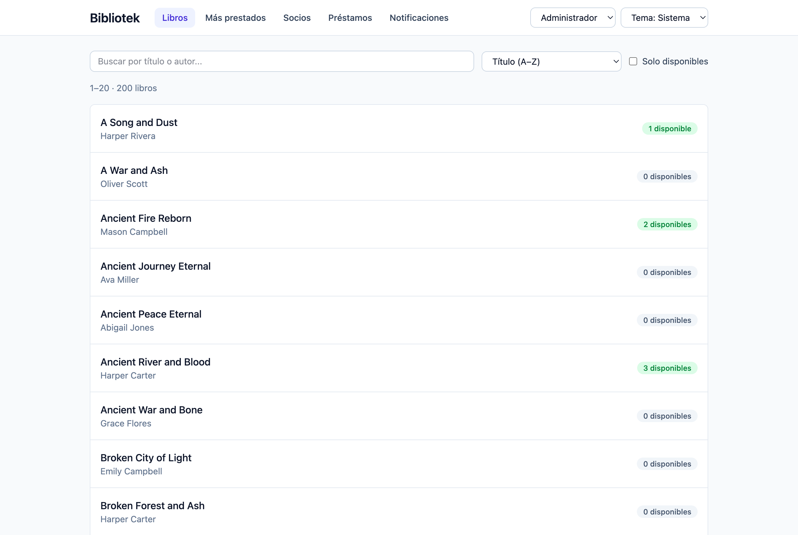
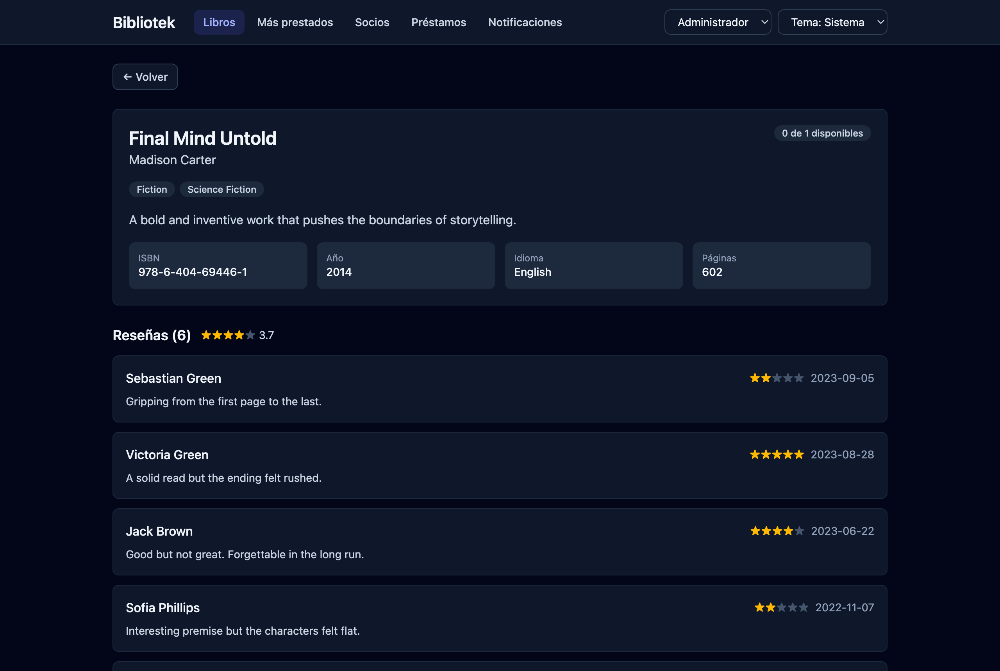
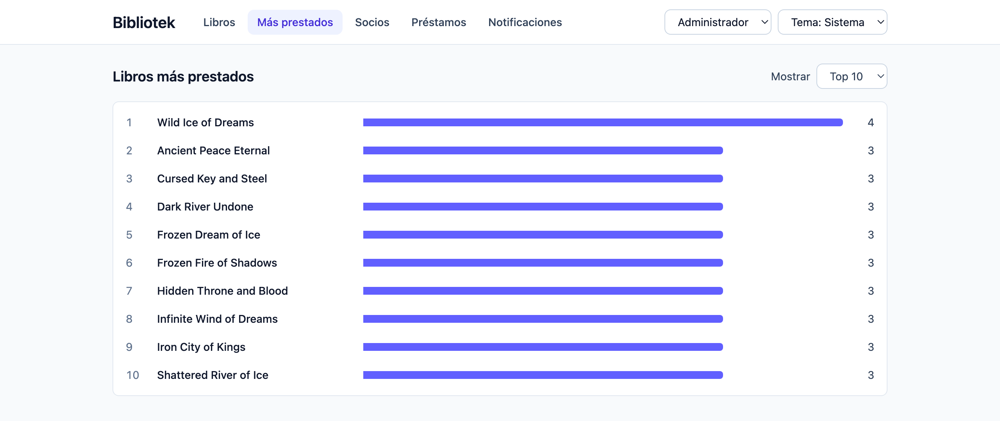
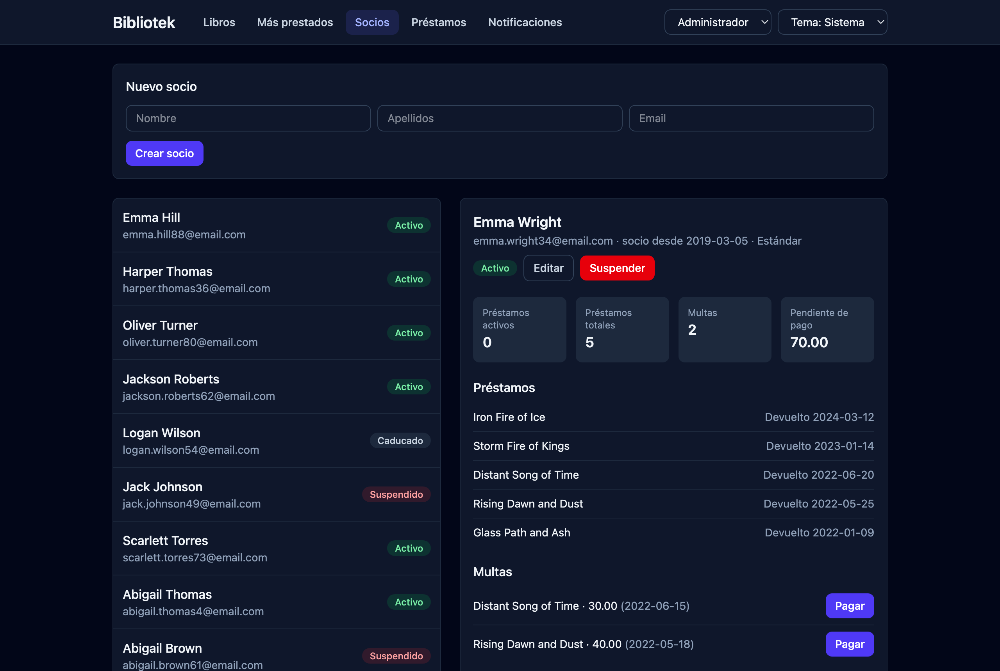

# Bibliotek – frontend

[](https://github.com/JoseMunozO/bibliotek-react-ts/actions/workflows/ci.yml)

Webbgränssnitt för biblioteksystemet **Bibliotek**, byggt med React, TypeScript och Tailwind CSS. Applikationen pratar med REST-API:t [bibliotek-api](https://github.com/JoseMunozO/bibliotek-api) (Java 25 + Spring Boot + MySQL).

## Skärmbilder

| Böcker (ljust läge) | Bok med recensioner (mörkt läge) |
|---|---|
|  |  |
| **Mest utlånade (ljust läge)** | **Medlemsprofil (mörkt läge)** |
|  |  |

## Funktioner

- **Böcker** – lista med sökning på titel eller författare, sortering (titel, författare eller antal lediga exemplar), filter för tillgängliga böcker och sidindelning (20 per sida), samt en detaljsida med kategorier, ISBN, språk, antal sidor och tillgängliga exemplar.
- **Recensioner** – alla recensioner av en bok med genomsnittligt betyg, samt ett formulär för att skriva en ny (1–5 stjärnor). Endast medlemmar som har lämnat tillbaka boken kan recensera den.
- **Mest utlånade** – topplista med stapeldiagram (topp 5, 10, 20 eller 50).
- **Medlemmar** – registrera nya medlemmar, se en medlems profil med lån, böter och statistik, redigera uppgifter och medlemskapstyp, betala böter och stänga av medlemmar.
- **Lån** – nya lån (14 dagars lånetid), förlängning, återlämning med automatisk förseningsavgift och en lista över försenade lån.
- **Aviseringar** – en medlems aviseringar med filter för olästa, markera som läst och skicka nya aviseringar.

### Roller

Det finns ingen inloggning. I stället väljer man en roll i sidhuvudet, precis som i bibliotekets ursprungliga konsolprogram:

| Roll | Kan |
|---|---|
| **Medlem** (*Socio*) | Bläddra bland böcker, recensera som sig själv och se sitt konto: profil, lån, böter och aviseringar. Kan redigera sina uppgifter men inte sin medlemskapstyp. |
| **Bibliotekarie** (*Bibliotecario*) | Allt ovan plus hantera lån, ta betalt för böter, se medlemmar och skicka aviseringar. |
| **Administratör** (*Administrador*) | Allt ovan plus registrera, redigera och stänga av medlemmar samt ändra medlemskapstyp. |

Som medlem väljer man också vem man är. Valet sparas i webbläsaren. Rollerna styr bara gränssnittet – API:t har ingen autentisering.

### Mörkt läge

Appen följer systemets tema som standard, och i sidhuvudet kan man välja *Sistema*, *Claro* eller *Oscuro*. Valet sparas i webbläsaren och ett litet skript i `index.html` sätter temat innan sidan ritas, så att den inte blinkar till i ljust läge. Färgerna är semantiska tokens i `src/index.css` (`bg-surface`, `text-ink`, `border-line` …) med ett värde per tema, och alla text–bakgrund-kombinationer har en kontrast på minst 4,5:1 i båda lägena.

### Tillgänglighet

Fel- och bekräftelsemeddelanden är *live regions* (`role="alert"` respektive `role="status"`) som alltid finns på sidan, så att skärmläsare läser upp dem när de dyker upp. Även laddningsindikatorn och antalet böcker läses upp, och betygsstjärnorna anger valt betyg (`aria-pressed`) och genomsnittet som text.

## Teknik

| | |
|---|---|
| Ramverk | React 19 |
| Routing | React Router 8 |
| Språk | TypeScript 6 |
| Byggverktyg | Vite 8 |
| Styling | Tailwind CSS 4 (`@tailwindcss/vite`) |
| Kodkvalitet | ESLint med `typescript-eslint` och `react-hooks` |
| Tester | Vitest, Testing Library och jsdom |

Utöver React Router finns inga andra körtidsberoenden: API-klienten bygger på `fetch`.

## Kom igång

### Krav

- Node.js 22.22 eller senare (krävs av React Router 8; testat med Node 24)
- Backend [bibliotek-api](https://github.com/JoseMunozO/bibliotek-api) igång på `http://localhost:8090` – se dess README för databas och miljövariabler

### Installation

```bash
git clone https://github.com/JoseMunozO/bibliotek-react-ts.git
cd bibliotek-react-ts
npm install
npm run dev
```

Öppna sedan http://localhost:5173. Om porten är upptagen kan du välja en annan med `npm run dev -- --port 5174`.

### Skript

| Kommando | Beskrivning |
|---|---|
| `npm run dev` | Startar utvecklingsservern med hot reload |
| `npm run build` | Typkontrollerar (`tsc -b`) och bygger till `dist/` |
| `npm run preview` | Förhandsgranskar produktionsbygget lokalt |
| `npm run lint` | Kör ESLint |
| `npm test` | Kör alla tester en gång |
| `npm run test:watch` | Kör testerna och kör om dem vid ändringar |
| `npm run coverage` | Kör testerna med kodtäckningsrapport i `coverage/` |

Vid varje push och pull request till `main` kör GitHub Actions `npm run lint`, `npm test` och `npm run build` med Node 22 och 24.

## Koppling till API:t

Under utveckling skickar Vites proxy alla anrop till `/api` vidare till `http://localhost:8090`, så det behövs ingen CORS-konfiguration. Proxyn tar bort `Origin`-headern, vilket gör att det fungerar även om Vite körs på en annan port än 5173.

För ett produktionsbygge mot en annan server anger du API:ts adress i en `.env.local`-fil:

```bash
VITE_API_URL=https://min-server.se/api
```

## Adresser

Varje vy har en egen adress, så att man kan ladda om sidan, använda webbläsarens bakåtknapp och dela länkar:

| Adress | Vy |
|---|---|
| `/libros` | Böcker (sökning, sortering, filter och sida sparas i `?q=`, `?orden=`, `?disponibles=1` och `?pagina=`) |
| `/libros/:id` | Bokens detaljer och recensioner |
| `/mas-prestados` | Mest utlånade (`?top=5\|10\|20\|50`) |
| `/mi-cuenta` | Mitt konto (rollen Medlem) |
| `/socios`, `/socios/:id` | Medlemmar och en medlems profil |
| `/socios/:id/editar` | Redigera medlem (administratör) |
| `/prestamos` | Lån |
| `/notificaciones` | Aviseringar (`?socio=` väljer medlem) |

Om rollen inte har tillgång till en adress skickas man till `/libros`.

> Eftersom det är en SPA måste webbservern skicka `index.html` för alla okända sökvägar. Under utveckling sköter Vite det, och på Vercel gör `vercel.json` det (se [Driftsättning](#driftsättning)).

## Driftsättning

Frontend är förberett för [Vercel](https://vercel.com) och backend körs separat (t.ex. på Railway med en hanterad MySQL-databas).

1. Driftsätt först [bibliotek-api](https://github.com/JoseMunozO/bibliotek-api) och notera dess publika adress.
2. Importera det här repot i Vercel. Ramverket (Vite), byggkommandot och `dist/` läses från `vercel.json`, som också skickar alla sökvägar till `index.html`.
3. Lägg till miljövariabeln **`VITE_API_URL`** med backendens adress, t.ex. `https://bibliotek-api.example.app/api` (se `.env.example`). Den byggs in i appen, så efter en ändring måste projektet byggas om.
4. Tillåt Vercel-domänen i backendens CORS-inställningar, eftersom webbläsaren anropar API:t direkt från en annan domän.

Node 22.22 eller senare krävs (`engines` i `package.json`), vilket Vercel respekterar.

> **Obs:** API:t har ingen autentisering och rollerna styr bara gränssnittet. I en publik demo kan vem som helst ändra data, så använd en separat demodatabas som kan återställas.

## Projektstruktur

```
src/
├── api/
│   ├── types.ts       # TypeScript-typer som speglar API:ts DTO:er
│   ├── client.ts      # fetch-omslag, ApiError och getErrorMessage
│   └── index.ts       # booksApi, membersApi, loansApi, notificationsApi
├── components/        # Återanvändbara komponenter (Button, Input, Badge, Alert, Stars …)
│                      # och formulär (NewMemberForm, NewLoanForm, NewReviewForm …)
├── pages/             # En sida per vy: böcker, mest utlånade, mitt konto, medlemmar, lån, aviseringar
├── navigation.ts      # Hjälpfunktioner för URL:er (parseId, useGoBack)
├── session.ts         # Simulerade roller och behörigheter (useSession)
├── utils.ts           # Datum, belopp och etiketter för statusar
├── App.tsx            # Layout, navigering och routes
└── index.css          # Endast @import "tailwindcss"
```

## Använda API-klienten

Komponenterna anropar aldrig `fetch` direkt, utan går via objekten i `src/api`:

```ts
import { booksApi, loansApi, getErrorMessage } from '../api'

const books = await booksApi.list({ search: 'tolkien' })
const { fineAmount } = await loansApi.return(42)

try {
  await loansApi.create({ memberId: 1, bookId: 54 })
} catch (error) {
  // Meddelandet kommer från backend och kan visas direkt för användaren
  setError(getErrorMessage(error))
}
```

Alla fel från API:t har formen `{ status, message }` och kastas som `ApiError`. Gränssnittet är på spanska, liksom felmeddelandena från backend.

## Tester

Testerna ligger bredvid koden de testar (`*.test.ts` / `*.test.tsx`) och körs i jsdom. `fetch` mockas, så backend behöver inte vara igång.

- **API-klienten** – URL:er, metoder och request-kroppar för varje endpoint, felhantering (`ApiError`, nätverksfel, 502 från proxyn).
- **Logik** – behörigheter per roll, tolkning av id:n i URL:en och hjälpfunktioner.
- **Komponenter och sidor** – routing och omdirigering per roll, sökning, sortering och filter i URL:en (även att gamla svar ignoreras), lån (förlängning, återlämning med böter), medlemsprofil och recensionsformulär.

Hjälpfunktionerna finns i `src/test/`: `mockFetch` och `json` för att simulera API:t, `renderApp` för att rendera hela appen på en viss adress och med en viss roll, och `renderWithSession` för en enskild komponent.

## Licens

Projektet är licensierat under [MIT-licensen](LICENSE).
